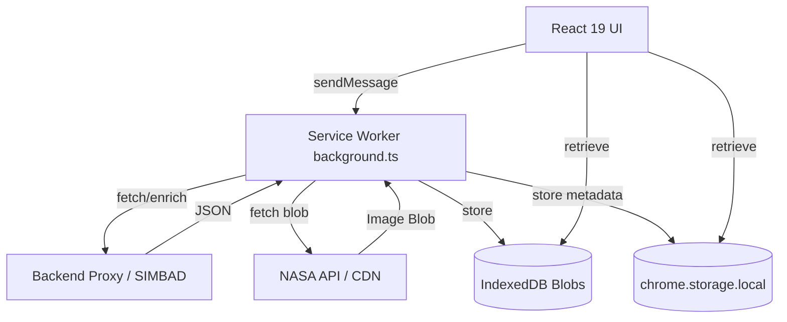

# 🌌 Space Image of the Day — Browser Extension

> _A new piece of the cosmos, every time you open a tab._

[](package.json)
[](https://react.dev/)
[](https://vitejs.dev/)
[](https://tailwindcss.com/)
[](LICENSE)

---

## The Story

I've always loved space. There's something humbling about opening a new browser tab and being reminded how enormous the universe is.

NASA publishes a new **Astronomy Picture of the Day (APOD)** every single day — a stunning image or video captured by telescopes and space missions from around the world. But the only way to see it was to visit their website directly. So I thought: _what if it was just there, every time you opened a new tab?_

That simple question turned into an engineering project that taught me more about browser extension architecture, API design, and UX empathy than I expected.

---

### Chapter 1: The Obvious Approach, and Why It Wasn't Good Enough

My first instinct was straightforward: the extension opens → fetch the NASA API → display the image. Simple.

But I immediately hit a problem: **The CORS Wall.**
Chrome extensions run in a very restricted security context. When a React component inside `index.html` tries to call `https://api.nasa.gov` directly, the browser blocks it.

I could have added the domain to `host_permissions` in `manifest.json` and been done. But then I thought further: every API call would happen in the UI thread, on every single new tab open. If NASA's API was slow, the user would stare at a loading spinner. If they opened 5 tabs quickly, they'd make 5 redundant API calls. And they'd burn through NASA's `DEMO_KEY` rate limit almost immediately.

### Chapter 2: The Service Worker as a Traffic Controller

Manifest V3 (the current standard) comes with a `background.ts` — a **Service Worker** that runs independently of the UI. It's the heartbeat of the extension.

I moved all data-fetching logic into the service worker:

1. **React UI** sends a message (`FETCH_APOD`).
2. **Service Worker** fetches, enriches, and caches the data.
3. **Storage** stores it in `chrome.storage.local`.

This architecture gives me:

- **No CORS/ORB issues:** Service workers have their own network context.
- **Centralized caching:** Data is cached at the service worker level — not the component level.
- **Zero redundant calls:** If the data for today is already cached, it's served instantly.

### Chapter 3: "What If the Server is Down?"

I built a backend (Node.js/TypeScript with Bun) to proxy NASA API calls and add SIMBAD astronomical enrichment. But I asked myself: _what happens when a user opens a new tab and my server is offline?_

For most web apps, the answer is "show an error." But this is a **new tab replacement**. If it breaks, it kills the user's entire browser workflow. Useability is non-negotiable.

So I built a **resilient offline fallback**:
Every successful fetch writes to local storage. On failure, the extension silently serves the most recently cached image. The user still gets their cosmic wallpaper — they just don't know the server had a bad day.

### Chapter 4: Enriching the Discovery

NASA's APOD data includes a title and explanation, but nothing about _what_ is actually in the image. I wanted to give users more context — the type of galactic object, additional resources.

I integrated the **SIMBAD Astronomical Database** to identify object types (Galaxy, Nebula, Pulsar, etc.). If SIMBAD fails, I built a keyword-matching fallback that reads the explanation text for clues. Now, users don't just see a "pretty picture"; they see a window into scientific classification.

### Chapter 5: The "Blurry Image" Problem (and the ORB fix)

NASA's 30-year archive includes images from the 1990s — sometimes as low as `480×320` px. Stretched on a 1440p monitor, they look terrible. To maintain a premium feel, I implemented **Image Probing** using `createImageBitmap` in the service worker.

- **Resolution Filtering:** The service worker probes pixel dimensions _before_ caching. If an image is too small, it retries for a better one from the random archives.
- **ORB (Opaque Response Blocking) Bypass:** To ensure images are always available offline, we now store the image **Blobs in IndexedDB** instead of just URLs. This prevents the browser from "forgetting" the image when the network is off.
- **Premium Curation:** I hand-picked a "Starter Collection" of high-resolution, horizontal galactic images. This ensures the first experience for every new user is visually breathtaking, even before the first background fetch completes.

### Chapter 6: Rethinking the UI for Intentionality

I initially built a complex 12-column grid. It looked stunning but it was **wrong.**
Users open a new tab to **go somewhere fast**. The imagery should be a backdrop to their intent, not compete with it.

I stripped it all down:

- **Wallpaper First:** The image fills the entire screen edge-to-edge.
- **Minimalist Widget:** All info lives in a subtle glassmorphism widget in the bottom-left.
- **Low-Res Center Mode:** If a small image is opted-in, it's rendered centered at natural size on an animated `StarField` background — intentional and artistic, never blurry.

### Chapter 7: The "Nerd-Scale" Experience (Conclusion)

The final piece was performance. I wanted "Zero Latency." To achieve this, I built a **Refill Buffer system.**

The extension maintains a queue of ready-to-go images. When you open a tab, it's already there — because it was fetched and pre-decoded yesterday, or while you were reading your last email. Combined with **Multi-lingual support** (11 languages) and a **Star Map Overlay** for the constellations, the project evolved from a simple "image fetcher" into a high-performance cosmic window.

Now, every time I open a tab, I'm not just seeing a website. I'm taking a 2-second journey into the deep field of the universe.

---

## 🛠️ Tech Stack

| Layer             | Technology                                                                  | Purpose                                    |
| ----------------- | --------------------------------------------------------------------------- | ------------------------------------------ |
| **Core**          | [React 19](https://react.dev/)                                              | Modern component-driven UI                 |
| **Build Tool**    | [Vite 6](https://vitejs.dev/) + [Bun](https://bun.sh/)                      | Blazing fast bundling & execution          |
| **Styling**       | [Tailwind CSS v4](https://tailwindcss.com/)                                 | Next-gen utility-first styling             |
| **Animations**    | [Framer Motion](https://www.framer.com/motion/)                             | Smooth transitions & UI micro-interactions |
| **Cross-Browser** | [webextension-polyfill](https://github.com/mozilla/webextension-polyfill)   | Unified support for Firefox & Chrome       |
| **Storage**       | [IndexedDB](https://developer.mozilla.org/en-US/docs/Web/API/IndexedDB_API) | Persistent Blob storage for offline images |

---

## 🚀 How it Works (Architecture)



---

## 📦 Installation

**Space Image of the Day** is available right now on the official browser extension stores!

*   [Install for Firefox](https://addons.mozilla.org/en-US/firefox/addon/space-image-of-the-day)
*   [Install for Chrome / Edge](#) *(Link coming soon)*

### Try it Locally

If you want to try the interface without installing the extension, you can run it locally in your browser:

```bash
git clone https://github.com/tarekul42/space-image-of-the-day-frontend.git
cd space-image-of-the-day-frontend
bun install
bun run dev
```

Preview at `localhost:5173`. The UI will detect it's not in an extension environment and fall back to direct API calls automatically.

---

## 🗺️ Roadmap

### v1.0 — Shipped ✅

- [x] **Zero Latency Buffer**: 10-image queue pre-refilled in the background.
- [x] **Curated Galactic Starter Set**: Hand-picked, high-resolution interstellar imagery for the initial experience.
- [x] **Offline Survival**: Full IndexedDB blob storage for images.
- [x] **SIMBAD Enrichment**: Identification of celestial object types.
- [x] **Multi-lingual support**: 11 languages (server-translated).
- [x] **Resolution Filtering**: Probing `createImageBitmap` for HD quality.
- [x] **Star Map Overlay**: Interactive constellation guide.

### v2.0 — Planned 🚀

- [ ] **Real Positional Mapping**: RA/Dec mapping from SIMBAD to sky-maps.
- [ ] **Central Search Bar**: Optional search field for quick navigation.
- [ ] **This Week in Space**: Slideshow mode for the last 7 days.
- [ ] **Quick-Links**: Customizable bookmarks row.

---

## 📜 License

This project is licensed under the MIT License - see the [LICENSE](LICENSE) file for details.

_Built with curiosity. 🌌_
